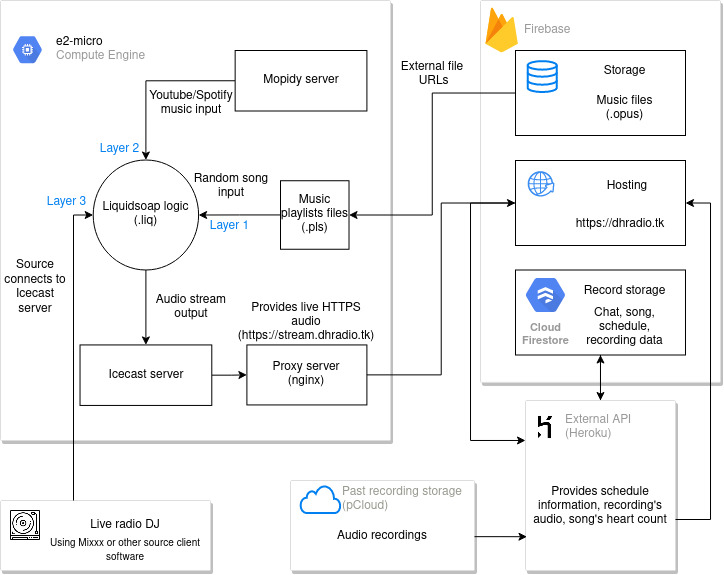

# Darkest Hour Radio
**See the radio in action here: [Darkest Hour Radio](https://dhradio.tk)**  
Internet radio built with [Icecast](https://icecast.org), [liquidsoap](https://www.liquidsoap.info) and [Mopidy](https://mopidy.com) and hosted on **Google Cloud Platform** _(server)_, **Firebase** _(music files and website)_ and **Heroku** _(external API)_. Radio has the capabilities of broadcasting **live audio from DJ**, **Spotify/YouTube**, play **remote music files** when nothing else is broadcasting or **listen to previous broadcasts**.

#
## Things I learned:
- Working with cloud providers (GCP and Firebase)
- The basics of linux systems

#
## How it's built
_App architecture diagram:_ 
 
The goal of the project was to make a free or as cheap as possible internet radio (_as a student, need to save money_). 
The main radio server is hosted on GCP e2-micro server (2vCPU, 1 GB RAM) running Debian 10. The main logic is controlled with liquidsoap, which takes in 3 inputs (music files, Mopidy output and Live radio output) and determines which one to output to the Icecast server. The inputs are set in layers, so if a higher level output starts playing, liquidsoap changes to it (with a nice jingle as well). For example, if live DJ connects, then the listeners will hear that, but when he disconnects, it will switch to Mopidy or music files. 
### The properties of main input layers are:
- **Music files** (lowest layer): 
Music files are stored in Firebase as .opus files. Opus format provides the best audio quality at [lower bitrate](http://listening-test.coresv.net/results.htm) (compared to MP3 and Vorbis) which is needed in order to stay under the Firebase free tier provided maximum bandwith (1GB/day). 
On the server itself only .pls files are stored as playlists which contain the URLs to files stored on Firebase. 
Additionally, liquidsoap picks files randomly and adds a crossfade between the tracks.
- **Mopidy** (second layer): 
With Mopidy, the admin can play any audio from YouTube or Spotify to the radio. The audio is streamed to an Icecast server via [GStreamer](https://gstreamer.freedesktop.org) sink (shout2send) which is then picked up by liquidsoap.
- **Live audio** (highest layer): 
Live audio is broadcasted from connected server client (for example [Mixxx](https://mixxx.org)) to Icecast server, which is picked up by liquidsoap like Mopidy.

The main website is built with React + Typescript and is hosted on Firebase. All the domain names are provided with [freenom.com](https://freenom.com) free domains (the goal is create the radio as cheap as possible).

Because of not too long ago updates to Chrome and Mozilla, HTTP traffic is marked as not secure and it is recommended to make all traffic HTTPS. This was the main reason setting up Load Balancer which was changed by a proxy server (nginx). The change was made because Load Balancer was not free and nginx provides a low recource alternative *(also free)*. It provides the SSL certificate for internal Icecast IP and this way the audio stream is not blocked on the website.

Radio also automatically displays song's album art. First wanted to use [Cloud Radio's](https://www.cloudrad.io) player, but it was sometimes not displaying any covert art at all so decided to make my own. [This repo](https://github.com/MrLemur/bottle-radio) also inspired to make my own player. Getting album art is done using [Cover Art Archive's API](https://coverartarchive.org). Album art is searched either by the song's name and artist, song's album or by album's MBID (depending on song tags or DJ wishes). All of this search is done with [Music Brainz's API](https://musicbrainz.org). Music files stored on cloud have appropriate tags which store song's title, artist and album or MBID. Getting the covert art by only the song's artist and name is mostly fine, but it often gets the wrong album art. Searching by album is much better, but still, not always correct, that's why using MBID sometimes. Also, not all song's have album art, but chose Music Brainz as it's an open music encyclopedia and you can add album art yourself.

The website also supports PWA and is fully installable on the phone or desktop for ease of use.

## API:
The server also has an API which is hosted on [Heroku](https://heroku.com). The API provides endpoints for 3 main features:
- **Song Hearts**: 
  Each user can be heart (like) a song and the count, as well as storing, updating and getting the heart count is done using the API.
- **Recordings**: 
  Past live radio recordings are recorded and stored in the cloud (*using [pCloud](https://pcloud.com) as a provider*). Getting the list of the recordings as well as getting the recording is done using the API. The API does not provide the actual url to the remote recordings but instead pipes it as a stream. The API also handles listener count and last read time of the recording.
- **Schedule** 
  The API also provides the schedule of the upcoming live radio shows. This way, the schedule does not need to be hardcoded into the React itself and can be changed remotely.

#
## Performance:
Although the server is hosted on the free GCP f1-micro Compute Engine with just 0.6 GB RAM because of the scalability of Icecast, it can easily support 100 listeners at once. Everything mainly depends on liquidsoap output encoding and scaling up to 100 listeners doesn't put much additional stress on CPU or memory (only about 2-5% increase), only the bandwidth.

Preferably would choose Opus format as output for best audio quality over small bandwith, but Icecast doesn't put [audio metadata](http://lists.xiph.org/pipermail/icecast-dev/2017-July/002628.html).

Some unprofessional testing results (_with 10 listeners_):
Audio format | CPU usage | Memory usage | Audio quality*
------------ | --------- | --------- | ------------
MP3 (112kBps) | 30% | 70% | normal
MP3 (64kBps) | 35% | 72% | very bad
Vorbis (112kBps) | 23% | 70% | good
Vorbis (64kBps) | 80% | 68% | normal

*Audio quality determined just by simply listening and personal taste.

# 
## Planned things to improve (if radio will be used)
- [X] Add the ability to listen to previous live broadcasts
- [ ] Broadcast Icecast with Opus format
- [ ] Display recently played songs
- [ ] Improve scalability by adding relay Icecast streams
- [ ] Add metadata to Mopidy
- [X] Add indicator to show broadcasting is live
